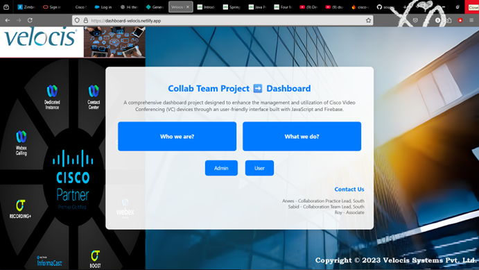
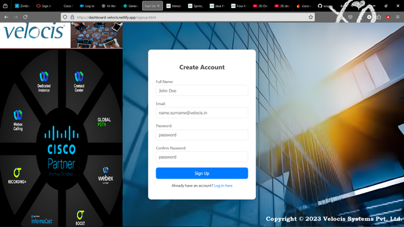
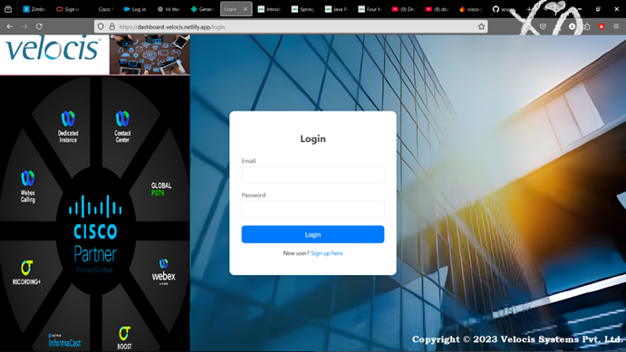
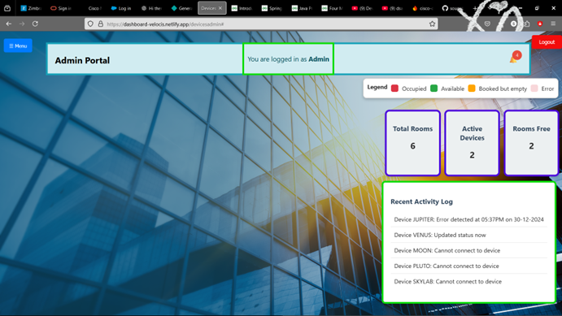
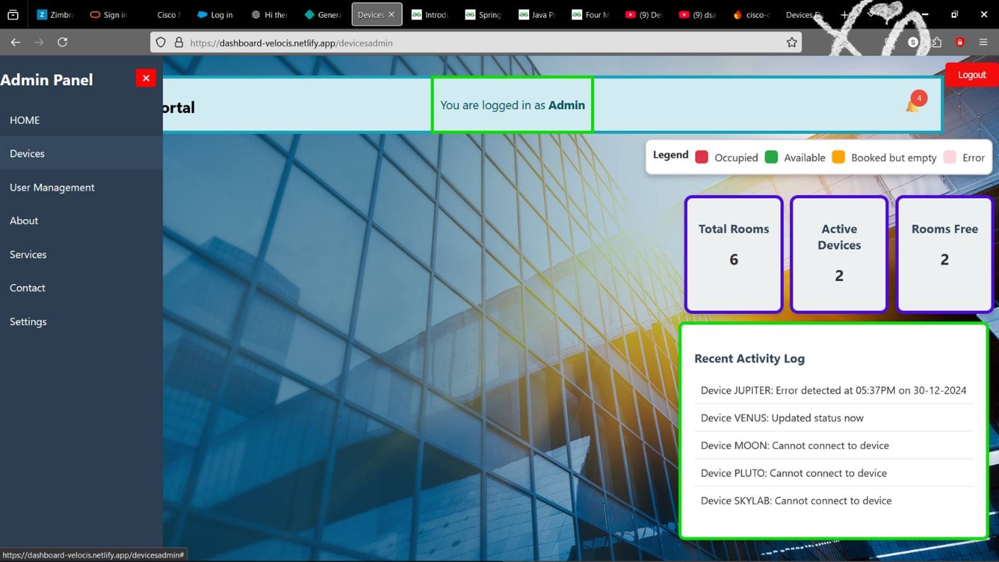
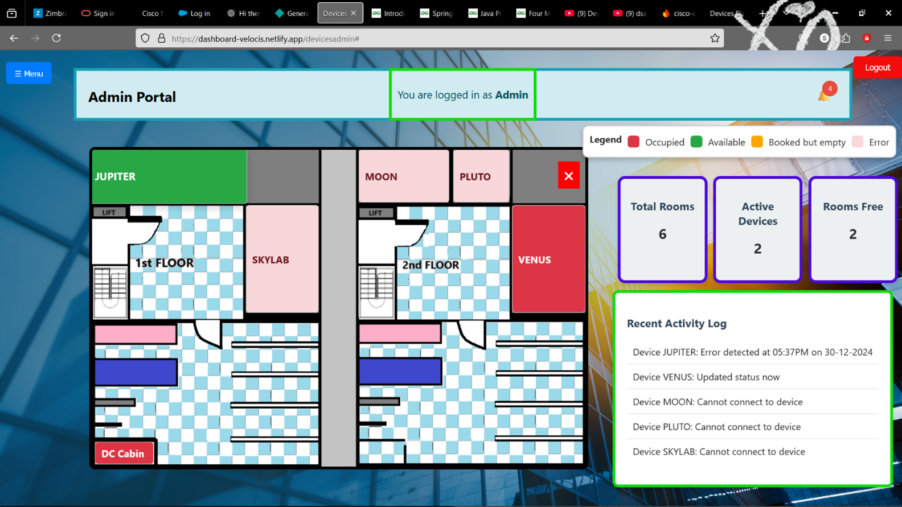
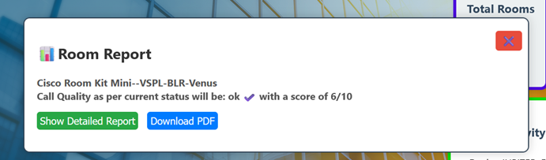
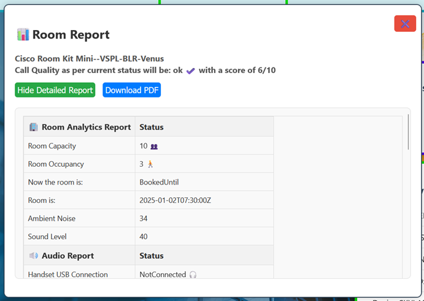
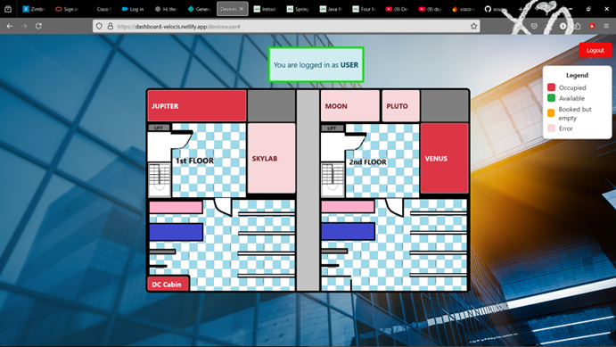
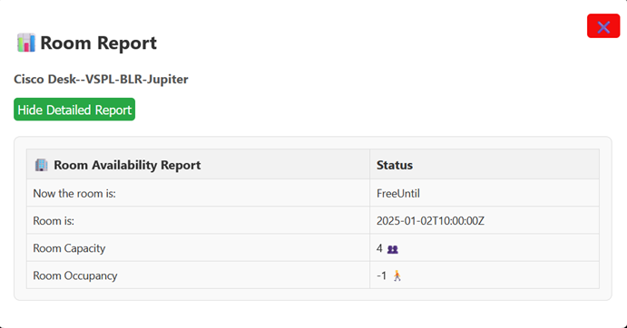

<p>
    
    
    
    
</p>

# Cisco Devices Dashboard

### Homepage


### Signup Page


### Login Page


## Overview
The Cisco Devices Dashboard is a web application designed to provide users with insights into the call quality and status of various devices in a room. It allows users to sign up, log in, and view detailed reports on device performance, including audio, video, and room analytics.

## Features
- User authentication with email verification.
- Admin and user roles with different access levels.
- Dynamic device list with search functionality.
- Detailed reports on device status, including call quality, room occupancy, and audio/video performance.
- Responsive design for optimal viewing on various devices.

### Admin Portal: Home Page


### Admin Portal: Sidebar Menu


### Admin Portal: Devices Menu


### Admin Portal: Room Report (Quick View)


### Admin Portal: Room Report (Detailed)


### User Portal: Home Page


### User Portal: Room Report



## Technologies Used
- **Frontend**: HTML, CSS, JavaScript
- **Backend**: Firebase for authentication and database management
- **Libraries**: 
  - Firebase SDK for web
  - Axios for HTTP requests
  - Express for server-side operations (if applicable)

## File Structure
        /dbcopy-final
        │
        ├── /public
        │   ├── dcVP.html               # Profile page for Divakar Chaubey
        │   ├── devicesADMIN.html       # Admin dashboard for device management
        │   ├── devicesUSER.html        # User dashboard for device monitoring
        │   ├── login.html              # User login page
        │   ├── signup.html             # User signup page
        │   ├── styleDC.css             # CSS styles for the profile page
        │   └── scriptDC.js             # JavaScript for the profile page
        │
        ├── /functions
        │   ├── index.js                # Firebase functions for backend operations
        │   └── package.json            # Dependencies for Firebase functions
        │
        ├── package.json                 # Main project dependencies
        └── README.md                    # Project documentation


## Installation
1. Clone the repository:
   ```bash
   git clone https://github.com/yourusername/cisco-devices-dashboard.git
   cd cisco-devices-dashboard
2. npm install
3. Set up Firebase:

    Create a Firebase project in the Firebase Console.
    Add your Firebase configuration to the relevant files in the project.
4. Start the application:

    For the frontend, you can use a simple HTTP server or deploy it to Firebase Hosting.
## Usage
Navigate to the login page to access the application.
New users can create an account using the signup page.
Admin users will have access to the admin dashboard, while regular users will see the user dashboard.
Contributing
Contributions are welcome! Please fork the repository and submit a pull request with your changes.

## License
This project is licensed under the MIT License - see the LICENSE file for details.

## Acknowledgments
Thanks to the Firebase team for providing a robust backend solution.
Special thanks to the open-source community for their contributions and support.
